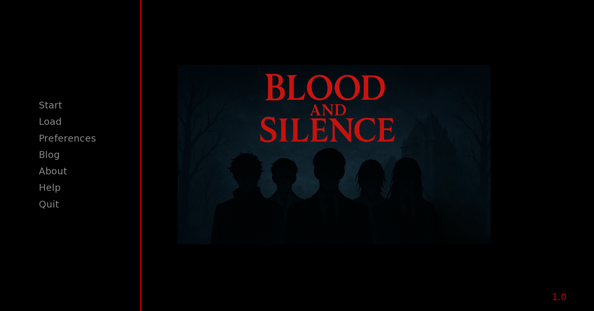
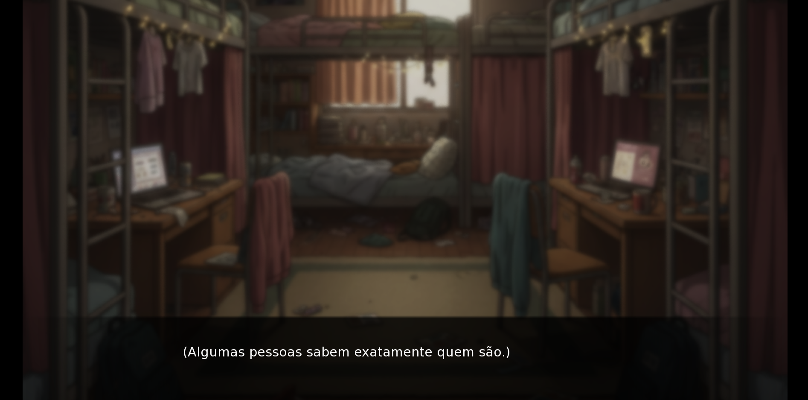
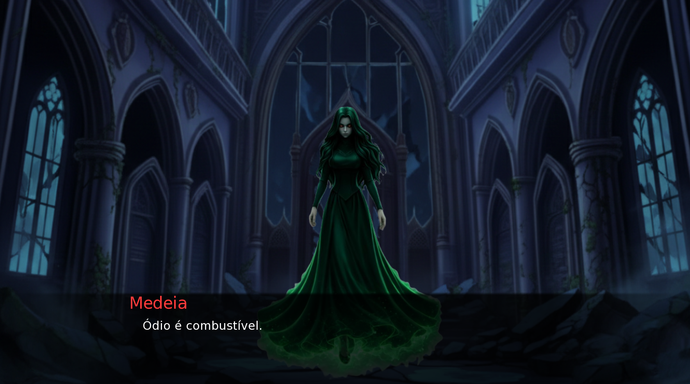

#  Blood And Silence

> Uma visual novel sombria.

---

## 📷 Screenshots

---

## 🌒 Sobre o Jogo

Blood And Silence é uma visual novel independente focada em narrativa, romance e consequências emocionais.

A história acompanha uma herdeira ligada a um artefato antigo — um colar capaz de manter ou romper o equilíbrio entre o mundo dos vivos e o domínio das sombras.

Suas escolhas influenciam:

- Afinidade com personagens
- Conflitos e desfechos
- O rumo emocional da protagonista

---

## Personagens

- **Lucien** — Sarcástico, intenso e imprevisível.
- **Elias** — Sereno, protetor e marcado por segredos antigos.
- **Klaus** — Estratégico, disciplinado e guiado pelo dever.
- **Jake** — Carismático, mestiço de vampiro e elfo, dividido entre dois mundos.

---

## Plataforma

- Windows
- Linux
- macOS  

---

## 📦 Download

👉 [Baixar Blood And Silence](LINK_AQUI)

---

## 🛠 Tecnologias

- Engine: Ren’Py
- Roteiro original publicado no Wattpad
- Projeto independente

---

## Desenvolvedora

Projeto criado por uma única desenvolvedora apaixonada por otome games, fantasia sombria e sistemas narrativos interativos.

---

## 📬 Feedback

Se quiser deixar sua opinião ou acompanhar atualizações:

👉 [Visite o Blog](bloodandsilencegame.netlify.app)

---

> "Algumas sombras nunca desaparecem."
